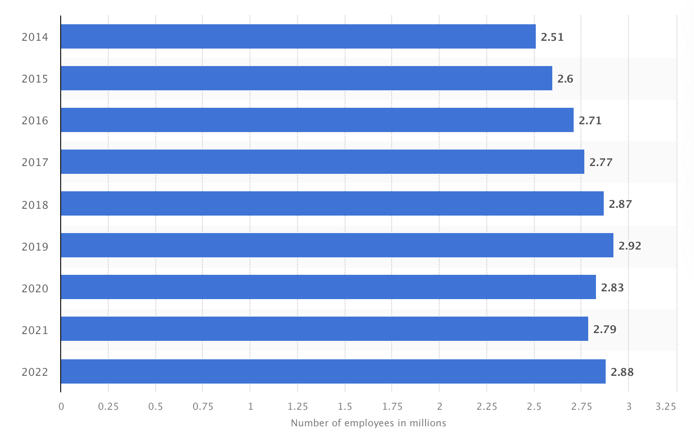

# 1. Introduction

The idea is to explore how the use of Large Language Models (LLMs) as General Purpose Technology (GPT) could reshape industries, considering the generalization capabilities of LLMs and the rapid adoption of these tools by the public and firms.

A. Background on the potential economic impact of Large Language Models (LLMs) as General Purpose Technology (GPT) 
B. Objective of the paper: Exploring how the use of LLMs as GPT could reshape industries and contribute to economic growth

Generalization of tools seems to be an important characteristic to leverage the potential of growth and development, because if a same tool could be broad use for different purposes, so the tool becomes in a very valuable tool.

Until now the abilities reached by the Large Languages Models LLMs have arisen to a certain level of computational power that might require scaling up past this threshold (10^23 training FLOPs), meaning that they are able to perform multiple tasks related to Text Understanding and Generation,Problem Solving and Mathematics, Image and Data Classification, Text Analysis and Comprehension, and so on, but as [@weiemergent] suggested for future works, it could be possible new abilities could emerge scaling up the models and understanding how emergence occurs would provide new insights into how to train more-capable language models.

On the other hand, the use of LLMs as a base technology of other tools, such as software-AI powered, open a new window and enveloped the potential of productivity improvements of the work-human force or human capital as it was mention by [@gptaregpts] telling that LLMs such as GPTs exhibit traits of general-purpose technologies, could have considerable economic, social, and policy implications.

So, the potential arising of emergent abilities and the wide use of LLMs as enablers of new tools (AI based-software) alongside the spread use of tools such as ChatGPT by a large amount of humans (here: million of users of chatGPT), it could signify a future unseen before by the human beings, because the expansion and pushing of new boarders and limits would be accelerated.

# 2. Generalization Capabilities of LLMs as GPT 
A. Examining the adoption rate of previous GPTs

Investigating the adoption rate of various GPTs, [@Chen2021HowDL] examined how worker mobility affects the likelihood of an establishment adopting a new general-purpose technolog]. By examining data from over 153,000 establishments between 2010 and 2018, it was observed how these establishments made decisions regarding the adoption of machine learning. The findings from the study showed a significant decline in adoption likelihood when there were facilitations in worker movements.
According to the [@Helpman1996DiffusionOG], both historical evidence and theoretical models indicate that General Purpose Technologies (GPTs), like the steam engine and electricity, are pivotal for economic progress. The author further demonstrates that the stepwise adoption of a GPT across sectors leads to a dual-phase cycle, ultimately resulting in prolonged economic growth.

B. Key factors contributing to the widespread adoption of a technology as a GPT

The study by [@Qiu2018TheIG] observes a trend towards internationalized innovation networks in multinational corporations. Through a U.S. patent database from 1969-1995, it's found that the development of general purpose technologies (GPTs) is tied to the globalization of corporate innovations. The observations are in line with [@Chen2021HowDL], which further finds that actors such as establishment characteristics and industry conditions play a crucial role in this adaptation. Notably, establishments with greater size, more large establishments in their vicinity, and heightened experimentation with analytics technology exhibit a particularly healthy environment for the widespread adoption of a technology as a GPT.

C. Reviewing the literature on the potential of AI as a GPT

Artificial intelligence a term coined by emeritus Stanford Professor John McCarthy in 1955, was defined by him as “the science and engineering of making intelligent machines”.[^1] These systems are designed to simulate human cognitive abilities, such as learning, reasoning, problem-solving, perception, and language understanding. Within the realm of AI, Large Language Models (LLMs) are a specific type of AI model that utilizes deep learning techniques, particularly neural networks, to process and generate human-like language. LLMs are trained on vast amounts of text data and can perform tasks like language translation, text summarization, and question answering. 

In the past, computer programs were developed by painstakingly encoding human knowledge, following a precise set of instructions that mapped specific inputs to desired outputs. This approach required programmers to meticulously define every step of the process. However, machine learning systems operate differently. They utilize general algorithms, such as neural networks, which enable them to independently determine the appropriate mapping between inputs and outputs. This is achieved through exposure to extensive datasets containing numerous examples. By analyzing and learning from these examples, machine learning systems can identify patterns and make accurate predictions or classifications without explicit programming instructions.

General Purpose Technology is a transformative technology with a strong improvement process at the begining and eventually becoming widely adopted for its multiples uses, while producing many spillover effects [@paradox]. As such, it have a pervasive impact on society as a whole, mainly due to its capability to redefine the ways in which businesses operate, improve productive and contribute to long-term economic growth. Some well-know examples are steam power, electricity, semiconductors, and internet.

Is it the AI a General Purpose Technology?

[^1]: Available at: https://hai.stanford.edu/sites/default/files/2020-09/AI-Definitions-HAI.pdf


# 3. What is the potential Economic Impact of AI? 

What we are trying to do is following:


So, during times of structural changes as now, is difficult to see the results of this new technologies, because the contributions in growth that the successfull firms could make as offset by the decreases profits of the outgoing firms. And this is why I think that the statistics is not yet reflecting the potential benefits of the use of AI.

This can be ilustrated in Figure N, where the increases in investment, are still not reflecting their fruits in increasings in the total factor of productivity TFP.

- Graph of Investments during the last 10 years and TFP in the US.
-Index of readiness to use AI by country

The intangible assets associated with the last wave of computerization were about ten times as large as the direct investments in computer hardware itself. paradox
We think it is plausible that AI-associated intangibles could be of a comparable or greater magnitude. 

---------

Considering the potential of the AI as a new GPT, specifically the LLMs, assessing its potential contribution to the economic growth is worthy during fast-pace changing times as now. The uncertainty's winds are everywhere and setting expectations might be useful. Given the uncertainty condition and the poor accuracy of predictions, assessing its potential impact seems to be address only by a retrospective approach, what it means that the performance of previous General Purpose Technology like steam power, electricity or internet, might give a more realistic answer to this question.

However, this topic have already addressed by [@paradox] and [@Nicholas], in a context where are optimists and pessimists about technology and growth. It arises a genuine dichotomy between higher profit expectations of forward looking entrepreneurs, and the poor growth performance reflected in the the backward looking statistics.

One example mentioned by [@paradox] is the call center industry, which had approximately 2.2 million agents in 2015 in the United States. It was plausible at that time to anticipate that voice recognition systems like IBM's Watson could potentially reduce the number of workers by 60%. However, in hindsight, it is evident that the expectations have not been fully met, as shown in Figure \ref{fig1}, which illustrates the statistics.


```{r path, echo = FALSE, include = FALSE}
rm(list=ls())
getwd()
path_sript <- rstudioapi::getActiveDocumentContext()$path
path_folder <- dirname(path_sript)
setwd(path_folder)
```

```{r fig1, fig.width = 5, fig.height = 5, fig.align='center', out.width="70%", fig.cap = "\\label{fig1}Number on contact center employees in the United States from 2014 to 2022.", echo = FALSE}

```

As [@paradox] explain, this apparent incongruence relies on the time lag between the technology creation and the full realization of its benefits on the economy and society. It takes time to build the stock of the new technology, develop the necessary human capital skillset, undergo the re-engineering process of business process transformations, and develop complementary innovations for its full realization in the real economy.

To support this lag explanation, the Schumpeterian Growth Model might give another good perspective, taking as a starting point that real contributions to growth are value creation and cost optimization, so the AI should be at the service of those growth contributors.

## Gauging the potential economic impact of AI in terms of value creation and cost optimization 

From an economic perspective, one of the fundamental problems to understand the firm's behavior is the look for profit maximization by firms. This goal drives the economic growth and leads to two main objectives in the private business sector: adjusting the production function to come up with the right quantities to supply the market, while facing constraints, often in the form of a limited budget. 

The profit maximization firm's goal can be represented as follows:
$$
Profit = Total \ Income - Total \ Costs: \Pi = PX - C(X)
$$
$$
Maximization \ Problem: \max_{x} \Pi(X) = PX - (wL + rK)
$$
Where PX represents the revenue generated by the production function X, and C(X) represents the corresponding costs associated to the costs of labor and capital. Thus, on one side of the coin, value creation contributes to increase profits by adjusting the outcome of the production function X, while on the other side, cost optimization aims to mitigate not only budget restrictions, but also limited resources. Therefore, AI should be directed towards achieving one or both of these goals in order to promote growth.

To exemplify AI value creation, consider the use of deep neural network systems in diagnosing skin cancer [@cancer], detecting fraud and assessing risks in the financial sector, and automating inventory forecasting, as seen in Amazon's AI-Powered Inventory Management. On the other hand, from a cost optimization perspective, AI is employed in predictive maintenance and quality control to anticipate equipment failures[^2].

## The Shumpenter's concept of creative destruction

Creative destruction refers to the process of creating and developing new technology that continuously disrupt and replace the existing obsolete technology in order to drive economic progress and growth.[^3].

So, consider 2 types of firms, whose are creators of new technology and great investors in Research and Development R&D, such as big-tech players like Apple, Amazon, Meta or Google, let's called Technology "Creators", and on the other side, firms which adopt and implement the new technology in order to maximize their profits through the more value added created by their production functions and cost optimization, or both, let's called Technology "Adopters".

Knowledge or innovation is considered a **public good**, one you have invented something , it becomes almost free of charge to disseminate it through the world. So, the first initial cost of producing the technology have to be covered through monopolistic profits (Creators), because this have been the mechanism that the market system have found to coverage the huge initial costs.[^4]

Once, the new technology have been released broadly to the market almost in an affordable price or even free as the case of ChatGPT, the adopter's maturity or readiness level require to be elevated in order to leverage the full potential of the new technology. It takes time from the adopter's perspective evolve to be able to incorporate the new technology in their business process in an effective way such as it produces benefits to the firm. This evolution requires developing new business process, adjust their production funtions to add value to their outcome and reallocate the skillset human capital who are able to address the transformation.

The destruction is represented in the Schumpeterian Growth Model as the expected years that firms will remain in the market, if they don't adapt. And this adaptation process is promoted mainly for the creation of new ideas E[A]. This time is represented in the following equation as follows:

$$
Firm \ Lifetime: E[\tau] = 1/E[A]
$$
$$
Firm \ Lifetime: E[\tau] = 1/\gamma N
$$
Where: New ideas corresponds to $E[A] = \gamma N$ 

The firm lifetime is reduced by the increasing of productivity (gamma) and the deployment of new technologies (N). This lead us to two transitional scenarios:
1. If the adopter are not able to incorporate the new technologies or take advantage of it, their profit will be diminishing until a possible exit of the market, when its profits will be zero, and thus, this firm will not contribute to the growth of the economy
2. If the adopter firm are able to incorporate the new technology or take advantage of it, their profit will increase, which in turn assurance their permanence in the market. However, this profit is not inmediatly reflected in the accounting aggregate statistics. The adaptation process takes time, due to development of new  business processes, the up-skillet of their human capital, the time required for the reallocation of a more skillset human capital from firms less capable to firms with more potential to growth or success. 

The number of AI related job postings has increased on average from 1.7% in 2021 to 1.9% in 2022 according to [@reportAI]. This increased trend can be seen in Figure \ref{fig2}. In 2022, the top three countries with the higher percentage of AI job postings were the United States (2.1%), Canada (1.5%), and Spain (1.3%). 

```{r fig2, fig.width = 5, fig.height = 5, fig.align='center', out.width="70%", fig.cap = "\\label{fig2} Percentage of all job postings that require some kind of AI skill by Geographic Area, 2014 to 2022.", echo = FALSE}
knitr::include_graphics("../Views/AI_job_postings_by_geo_area.pdf")
```

So, during times of structural changes as now, is difficult to see the results of this new technologies, because the contributions in growth that the successfull firms could make as offset by the decreases profits of the outgoing firms. And this is why I think that the statistics is not yet reflecting the potential benefits of the use of AI.

This can be illustrated in Figure \ref{fig3}, where the increases in investment, are still not reflecting their fruits in increasings in the total factor of productivity TFP.

```{r fig3, fig.width = 5, fig.height = 5, fig.align='center', out.width="70%", fig.cap = "\\label{fig3}Global Corporate Investment in AI by Investment Activity, 2013 to 2022.", echo = FALSE}
knitr::include_graphics("../Views/global_investiment_by_inv_activity.pdf")
```

```{r loading_TFP_DB, echo=FALSE}
library(readxl)

data_TFP <- read_excel("../Stores/OECD_Multifactor_Productivity.xls")
```

```{r plot_TFP, echo=FALSE}
library(ggplot2)
library(dplyr)

# Long format for easy plotting
data_TFP_long <- reshape2::melt(data_TFP, id.vars = "Year")
data_TFP_long <- data_TFP_long %>% rename(Country = variable)

ggplot(data_TFP_long, aes(x = Year, y = value, color = Country, group = Country)) +
  geom_line() +
  geom_smooth(data = filter(data_TFP_long, !is.na(value)), method = "lm", se = FALSE, linewidth = 0.5, linetype = "dashed", color = "black") +
  labs(title = "Multi Factor Productivity by OECD Country, 1996 to 2022",
       x = "Year",
       y = "TFP Value",
       color = "Country") +
  theme_minimal() +
  theme(legend.position = "bottom", axis.text.x = element_text(angle = 45, hjust = 1),
        plot.title = element_text(size = 10),  # Adjust plot title size
        axis.text = element_text(size = 8),   # Adjust axis text size
        legend.text = element_text(size = 8))  # Adjust legend text size
```

```{r estat_TFP, echo=FALSE}
library(dplyr)

data_stat <- data_TFP

# Calculate mean and median TFP for each year and add a new column 'Mean_TFP'
data_stat$Median_TFP <- apply(data_stat[, -1], 1, median, na.rm = TRUE)
data_stat$Mean_TFP <- apply(data_stat[, -1], 1, mean, na.rm = TRUE)

# Selecting only the necessary columns from data_TFP and storing in a new dataset
data_TFP_selected <- data_stat %>% select(Year, Mean_TFP, Median_TFP)
```

```{r plot_stat_TFP, echo=FALSE}
library(ggplot2)
library(dplyr)

# Long format for easy plotting
data_TFP_selec_long <- reshape2::melt(data_TFP_selected, id.vars = "Year")
data_TFP_selec_long <- data_TFP_selec_long %>% rename(Statistic = variable)

ggplot(data_TFP_selec_long, aes(x = Year, y = value, color = Statistic, group = Statistic)) +
  geom_line() +
  geom_smooth(data = filter(data_TFP_selec_long, !is.na(value)), method = "lm", se = FALSE, linewidth = 0.5, linetype = "dashed", color = "black") +
  labs(title = "Mean and Meadian of Multi Factor Productivity, 1996 to 2022",
       x = "Year",
       y = "TFP Value",
       color = "Statistic") +
  theme_minimal() +
  theme(legend.position = "bottom", axis.text.x = element_text(angle = 45, hjust = 1),
        plot.title = element_text(size = 10),  # Adjust plot title size
        axis.text = element_text(size = 8),   # Adjust axis text size
        legend.text = element_text(size = 8))  # Adjust legend text size
```

- Graph of Investments during the last 10 years and TFP in the US.

A country with an amount R of resources can destine some of them (Creators) toward doing R&D, while others (Adopters) to produce a certain level of activity or outcome X.

Creators: The proportion n is doing R&D: $nR$
Adopters: The remaining is going to output X: $(1-n)R$

If those firms are thought as a compound of human capital, the creators are individuals with the skillset needed to create new technology, while the adopters are individuals with enough skillset in produce X in the traditional business model. Now, as 


However, the availability of people with those skills is not something that you find at the side of the corner.


As the consumers do not be part of the process of production, this have been outside of this analysis.


[^2]: Available at: https://www.ge.com/research/project/predictive-maintenance
[^3]: Definition created with the help of [ResearchGPT](https://github.com/mukulpatnaik/researchgpt.git)
[^4]: Insights taken from this [Bilkent Üniversitesi lecture](https://youtu.be/m3nkTrFF2zs?si=dgPJlvVgQuuQAcL8)
-----
Total Factor Productivity should reflect the exceptional technological advance

Review data: CBInsights
- Labour Productivity Growth vs Global Investment focused on AI
- OECD Productivity Growth
- Real Median income has stagnated since the late 1990s 

Both capital deepening and total factor productivity (TFP) growth lead to labor productivity growth, and both seem to be playing a role in the slowdown

The old adage that “past performance is not predictive of future results” applies well to trying to predict productivity growth in the years to come, especially in periods of a decade or longer. Historical stagnation does not justify forward-looking pessimism. Taken from Paradox


C. Intangible capital - capital may not be reflected in the measurements of economic growth


AI developing skills: Perception and cognition

# 4. LLMs vs. Artificial General Intelligence (AGI) 
A. Understanding the difference between LLMs and AGI 

Large Language Models (LLMs) and Artificial General Intelligence (AGI), represent distinct approaches to AI. Understanding their differences and how they link together is crucial in navigating the evolving landscape of AI research and applications.
AGI, as defined by [@Zhou2023PathTM] is a highly autonomous entity with the remarkable capacity to comprehend, learn, and apply knowledge across an extensive array of tasks and domains. Unlike narrow AI systems, AGI aims to replicate the breadth of human cognitive abilities. This ambition makes AGI the pinnacle objective within the field of artificial intelligence.
One of the key distinctions between LLMs and AGI lies in their scope of intelligence. LLMs are specialized, focusing solely on language-related tasks. Another critical difference is in learning and adaptation. AGI systems, are designed for continual learning and adaptation. As described by [@Wang2012Chapter1I] AGI’s ability to be generalized on fundamentally new areas.


B. Exploring whether AGI is the real General Purpose Technology

The question of whether AGI can be considered the real General Purpose Technology is soon to become more relevant, as AGI has not yet reached its full potential and audience. While advanced LLM models like OpenAI's ChatGPT have undoubtedly revolutionized the way people work in a wide range of tasks, they represent just a glimpse of what AGI could ultimately achieve.
AGI, with its aspiration to replicate human-like general intelligence across various domains, holds the promise of transcending the limitations of narrow AI and becoming the ultimate tool for problem-solving and innovation. Paper by [@Mikki2023ArtificialGI] introduces the intriguing idea that achieving AGI may necessitate noncomputable systems. This concept challenges conventional thinking in AI by encouraging us to expand our understanding of AGI's potential. It suggests that AGI might require unconventional approaches beyond traditional computational frameworks.
While AGI has not yet fully realized its capabilities, it holds the promise of reshaping the technological landscape. Mikki's proposal of noncomputable systems, when integrated with other development ideas, offers a tantalizing glimpse into the future of AGI, where its transformative power knows no bounds.

# 5. Acknowledging Benefits and Limitations of LLMs as GPT 
A. Discussing the potential benefits of LLMs as GPT

One of the significant advantages of incorporating LLMs as GPT is the potential for substantial productivity gains. LLMs excel in natural language understanding and generation, making them valuable tools for automating tasks that involve processing and generating text. From content generation to customer support automation, LLMs can streamline processes, reduce labor costs, and boost efficiency. By automating routine language-related tasks, they free up human resources to focus on more creative and complex endeavors. In fields such as finance, healthcare, and market analysis, LLMs can assist in extracting valuable insights from unstructured data, leading to better-informed decisions and strategies.

B. Addressing the limitations and challenges associated with LLMs as GPT

While LLMs offer significant potential as GPT, it is essential to acknowledge the limitations and challenges associated with their widespread adoption. The use of LLMs raises ethical concerns, particularly in content generation and manipulation. LLMs rely on large datasets for training, often containing sensitive information. Safeguarding data privacy and ensuring compliance with data protection regulations is an ongoing challenge that must be addressed to harness the full potential of LLMs. 

# 6. Conclusion 
A. Summarizing the main points discussed in the paper 
B. Emphasizing the potential of LLMs as GPT in reshaping industries 

The positive expectations surrounding new technologies driving development, economic growth, and generating profits are often accompanied by optimism from industry leaders, technology experts, and venture capitalists. This optimism leads to speculative investments and forecasts of future company wealth in the financial sector. However, as [@paradox] suggests, there is no inherent contradiction between forward-looking technological optimism and backward-looking disappointment. Both can coexist, particularly during periods of transformative change. This can be attributed to human nature, as individuals desire to see their expectations fulfilled within their lifetime. However, it takes time for society to fully incorporate and benefit from new technologies, resulting in a slower pace of assimilation.


# Bibliography styles

Here are two sample references: @Feynman1963118 [@Dirac1953888].

By default, natbib will be used with the `authoryear` style, set in `classoption` variable in YAML. 
You can sets extra options with `natbiboptions` variable in YAML header. Example 
```yaml
natbiboptions: longnamesfirst,angle,semicolon
```

There are various more specific bibliography styles available at
<https://support.stmdocs.in/wiki/index.php?title=Model-wise_bibliographic_style_files>. 
To use one of these, add it in the header using, for example, `biblio-style: model1-num-names`.

## Using CSL 

If `citation_package` is set to `default` in `elsevier_article()`, then pandoc is used for citations instead of `natbib`. In this case, the `csl` option is used to format the references. Alternative `csl` files are available from <https://www.zotero.org/styles?q=elsevier>. These can be downloaded
and stored locally, or the url can be used as in the example header.

# Equations

Here is an equation:
$$ 
  f_{X}(x) = \left(\frac{\alpha}{\beta}\right)
  \left(\frac{x}{\beta}\right)^{\alpha-1}
  e^{-\left(\frac{x}{\beta}\right)^{\alpha}}; 
  \alpha,\beta,x > 0 .
$$

Here is another:
\begin{align}
  a^2+b^2=c^2.
\end{align}

Inline equations: $\sum_{i = 2}^\infty\{\alpha_i^\beta\}$


# Tables coming from R

Tables can also be generated using R chunks, as shown in Table \ref{tab1} for example.

```{r tab1, echo = TRUE}
knitr::kable(head(mtcars)[,1:4], 
    caption = "\\label{tab1}Caption centered above table"
)
```

# References {-}

